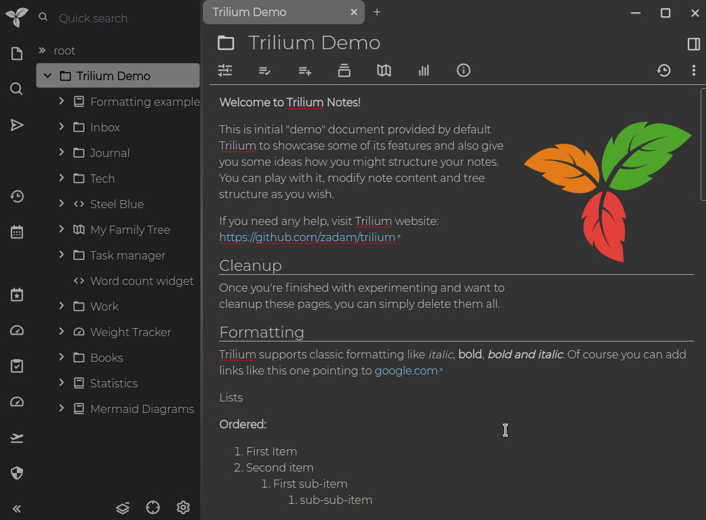
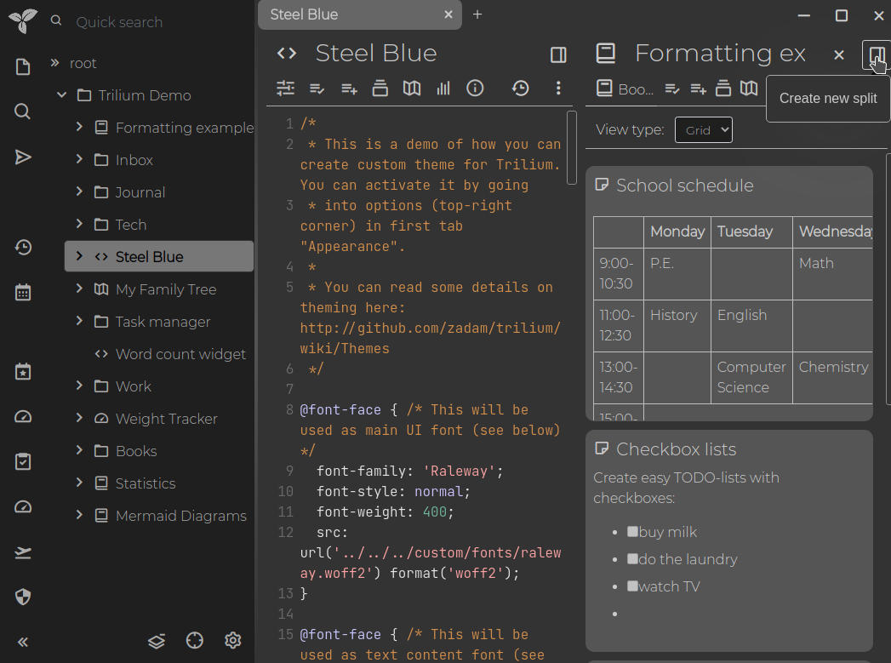
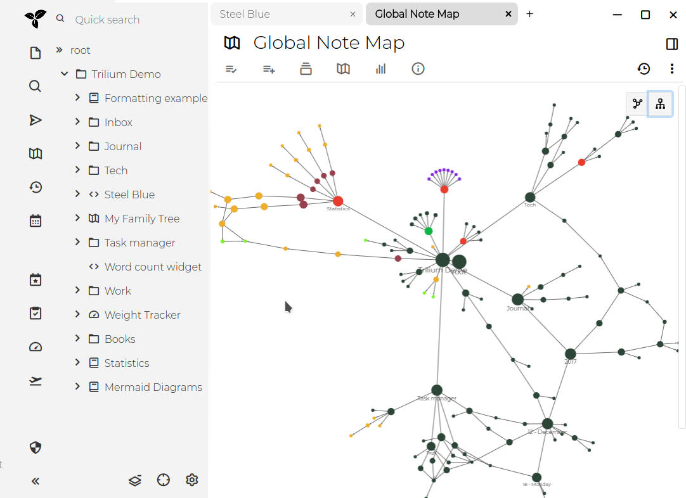
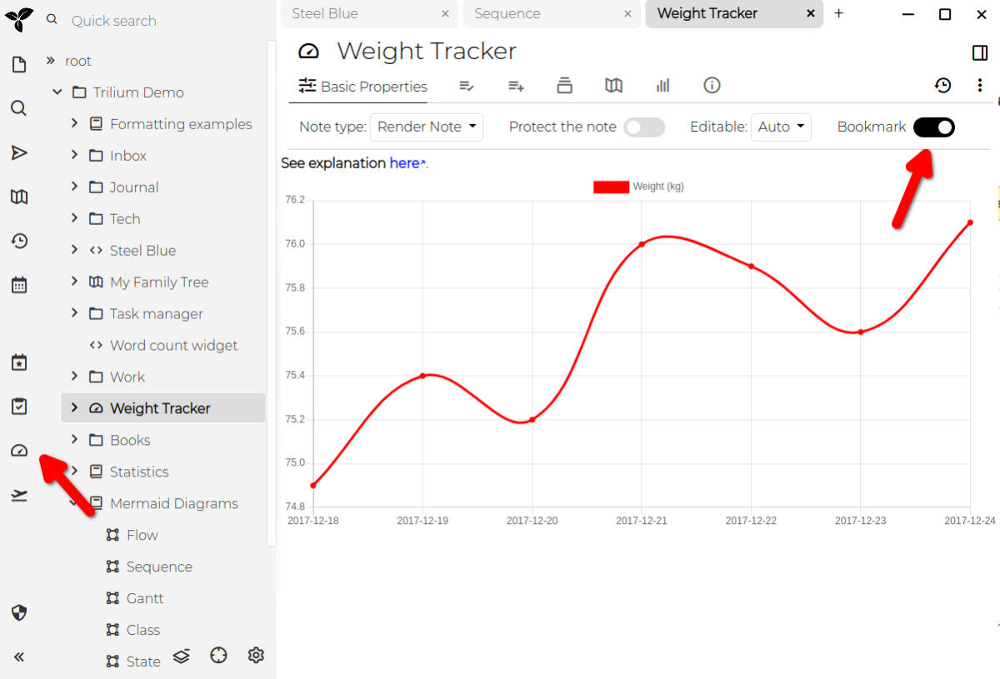

# Release notes v0.48
0.48 is a big release and contains many changes, some of them breaking:

Major frontend redesign
-----------------------



*   right panel is no more, most of these widgets have been moved to the new ribbon-style widget under note title
    *   right panel is still possible to activate for scripts
*   Trilium has a new icon (there might be further color changes)

Vertical split window
---------------------



Link map re-implemented
-----------------------

Now supports also hierarchical view of the notes:



Mermaid diagrams
----------------

Thanks to [@abitofevrything](https://github.com/abitofevrything) for this contribution!


Basic bookmark support
----------------------



Other changes
-------------

*   persistence/entity layer in backend was largely refactored - "repository" and unified with note cache which should bring performance improvements for many operations
*   search and SQL query notes now don't create “saved” notes by default
*   added underline heading style and make it a default
*   updated CKEditor to 30.0.0

Migration
---------

### Backup restore

Trilium v0.48 is currently in beta and may contain serious bugs.

Before migration to 0.48 Trilium will make automatically backup into `~/trilium-data/backup/backup-before-migration.db`. In case of problems you can restore this backup with this guide: [https://github.com/TriliumNext/Notes/wiki/Backup#restoring-backup](https://github.com/TriliumNext/Notes/wiki/Backup#restoring-backup)

### Direct upgrade only from 0.47.X

Direct upgrade to 0.48 is possible only from 0.47.X. If you want to upgrade from an older version, you need to upgrade to 0.47.X first and only then to 0.48. This is caused by extensive backend refactoring which broke older migration scripts.

### All backend script notes should avoid being async

Backend operations were in older versions used async/await because of the SQLite driver. But Trilium recently migrated to the synchronous (and much faster) `better-sqlite3`. As a consequence backend script notes which are wrapped in a transaction should to be converted to the sync variant.

e.g. old script looked like this:

```text-plain
const todayDateStr = api.formatDateISO(new Date());

const todayNote = await api.runOnBackend(async todayDateStr => {
    const dateNote = await api.getDayNote(todayDateStr);
    
    ({note: logNote} = await api.createNote(dateNote.noteId, 'log'));
}, [todayDateStr]);

api.activateNote(todayNote.noteId);
```

all the `await` (and `async`) should disappear from the backend code, but should remain when calling backend from frontend (that's still async):

```text-plain
const todayDateStr = api.formatDateISO(new Date());

const todayNote = await api.runOnBackend(todayDateStr => {
    const dateNote = api.getDayNote(todayDateStr);
    
    ({note: logNote} = api.createNote(dateNote.noteId, 'log'));
}, [todayDateStr]);

api.activateNote(todayNote.noteId);
```

### Migrate custom themes

With the redesign you might need to adjust your custom themes - check the modified list of available CSS variables in the [default theme](https://github.com/TriliumNext/Notes/blob/master/src/public/stylesheets/theme-light.css). If your theme also uses CSS selectors then that will probably have to be rewritten as well.

Themes are annotated with `#appTheme` label, previously this label could but did not have to contain value - with this release the value is required so define the label as e.g. `#appTheme=my-theme-name`.

Additionally, CSS themes are now loaded differently than before - previously all themes were loaded at the startup and which one was active was decided by the active CSS class. Themes were then prefixed like this:

```text-plain
body.theme-steel-blue {
    --main-font-family: 'Raleway' !important;
    --main-font-size: normal;

    --tree-font-family: inherit;
    --tree-font-size: normal;
    ...
}

body.theme-steel-blue .note-detail-editable-text, body.theme-steel-blue .note-detail-readonly-text {
    font-size: 120%;
}
```

This prefixing is not needed anymore (and also doesn't work anymore). Remove the prefixes like this:

```text-plain
:root {
    --main-font-family: 'Raleway';
    --main-font-size: normal;
    
    --tree-font-family: 'Raleway';
    --tree-font-size: normal;
    ...
}

body .note-detail-editable-text, body .note-detail-readonly-text {
    font-size: 120%;
}
```