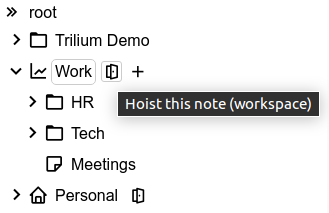

# Workspace
Workspace is a concept built up on top of [note hoisting](Note%20hoisting.md). It is based on the idea that a user has several distinct spheres of interest. An example might be "Personal" and "Work", these two spheres are quite distinct and don't interact together. When I focus on Work, I don't really care about personal notes.

So far workspace consists of these features:

*   [note hoisting](Note%20hoisting.md) - you can "zoom" into a workspace subtree to focus only on the relevant notes
*   easy entering of workspace:

*   visual identification of workspace in tabs:

### How to use workspaces

Let's say you have identified the workspaces and their subtrees. Define on the root of this subtree following labels:

*   `#workspace` - Marks this note as a workspace, button to enter the workspace is controlled by this
*   `#workspaceIconClass` - controls the box icon to be displayed in the tree and tabs, example `bx bx-home`. See [https://boxicons.com/](https://boxicons.com/)
*   `#workspaceTabBackgroundColor` - Background color of the tab, use any CSS color format, e.g. "lightblue" or "#ddd". See [https://www.w3schools.com/cssref/css\_colors.asp](https://www.w3schools.com/cssref/css_colors.asp).
*   `#workspaceCalendarRoot` - marking a note with this label will define a new per-workspace calendar. If there's no such note, the global calendar will be used.
*   `#workspaceTemplate` - This note will appear in the selection of available templates when creating a new note, but only when you are currently hoisted into a workspace containing this template.