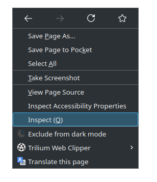
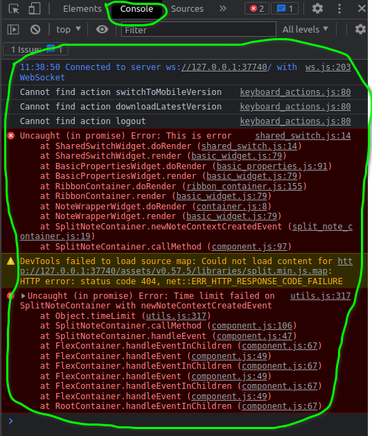
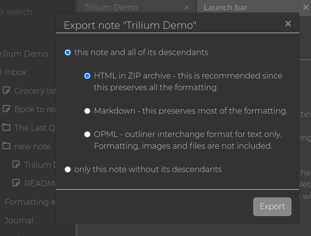

# Error-logs
It's important to provide all available error logs together with bug reports. This page will show you how to do it.

Backend logs
------------

Open [data directory](data-directory.md), go to `log` subdirectory and find the latest log file, e.g. `trilium-2022-12-14.log`. You can attach the whole file to the bug report (preferable) or open it and copy-paste only the last lines / lines you believe are relevant.

If you have trouble finding it the log files, there's also an in-app option in top-left menu button -> Advanced -> Show backend log.

Frontend logs
-------------

To provide frontend logs, we need to open the Developer Console. Often the easiest way is to press `CTRL-SHIFT-I` which should work in most browsers (and desktop app). Make sure that the error producing action happened right before you copy&paste the errors, the console is cleared on app restart.

If that doesn't work, then:

*   in Trilium desktop app, go to top-left menu button -> Advanced -> Open Dev Tools
*   In Firefox/Chrome right-click anywhere in the page and click Inspect:

Once you have Dev Tools open, click on "Console" tab:

Copy-paste (or screenshot) the logs. It's better to provide not just errors, but the whole log, which might provide context while analyzing the bug.

Providing sensitive data
------------------------

If you don't feel comfortable attaching the logs or anything sensitive to the public GitHub issues, feel free to contact the devs in our Matrix [support channel](https://github.com/TriliumNext/Notes#-discuss-with-us).

Use this email to also provide anything which could assist in analysing the bug - e.g. files/images/ZIPs being imported or [anonymized database](anonymized-database.md).

### Exporting note subtree for reproduction

Often times, bugs manifest themselves in specific notes and having them would greatly ease reproduction and fixing.

In such case, please export the relevant note subtree by right-clicking it on the left tree, choosing Export - HTML as ZIP:

